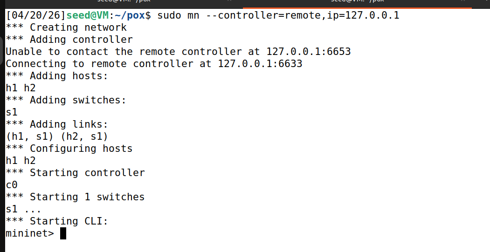

# SDN Network Utilization Monitor

## 📌 Project Description

This project implements a **Network Utilization Monitor** using Software Defined Networking (SDN).
It uses **Mininet** to create a virtual network and a **POX controller** to monitor traffic.

The controller periodically collects flow statistics from switches and calculates:

* Packet count
* Byte count
* Bandwidth (Bytes per second)

---

## 🎯 Objective

* Demonstrate controller–switch interaction
* Implement flow statistics monitoring
* Analyze network behavior under different traffic conditions

---

## ⚙️ Tools Used

* Mininet
* POX Controller
* OpenFlow Protocol

---

## 🧑‍💻 How to Run

### 1️⃣ Start POX Controller

```bash
cd ~/pox
python3 pox.py forwarding.l2_learning monitor
```

---

### 2️⃣ Start Mininet

```bash
sudo mn --controller=remote,ip=127.0.0.1
```

---

## 🧪 Test Scenarios

### ✅ Scenario 1: No Traffic

* Start Mininet
* Do not run any commands

**Expected Output:**

* Packet count remains low
* Bandwidth remains constant or minimal

---

### ✅ Scenario 2: Ping Traffic

```bash
h1 ping h2
```

**Observation:**

* Packet count increases slowly
* Bandwidth increases slightly

---

### ✅ Scenario 3: High Traffic (iperf)

```bash
h2 iperf -s &
h1 iperf -c h2
```

**Observation:**

* Packet count increases rapidly
* Bandwidth increases significantly

---

## 📊 Sample Output

```
====== Network Utilization ======
Top Flow Traffic
Packets    : 1200
Bytes      : 6485859782
Bandwidth  : 1297171956.4 B/s
================================
```

---

## 📸 Screenshots

### 🔹 Mininet Setup


### 🔹 Ping Test Output

### 🔹 iperf Test Output

### 🔹 Controller Output

---

## 🧠 Explanation

The controller requests flow statistics every 5 seconds from the switch.
It retrieves cumulative packet and byte counts and calculates bandwidth using:

Bandwidth = Bytes / Time

---

## ✅ Conclusion

This project successfully demonstrates real-time network utilization monitoring using SDN.
It highlights how controllers can dynamically observe and analyze network traffic.

---

## 📚 References

* Mininet Documentation
* POX Controller Documentation
